# qwen2API

将通义千问网页版能力转换为 OpenAI 兼容的 API 接口，支持最新 **qwen3.6-plus** 模型。

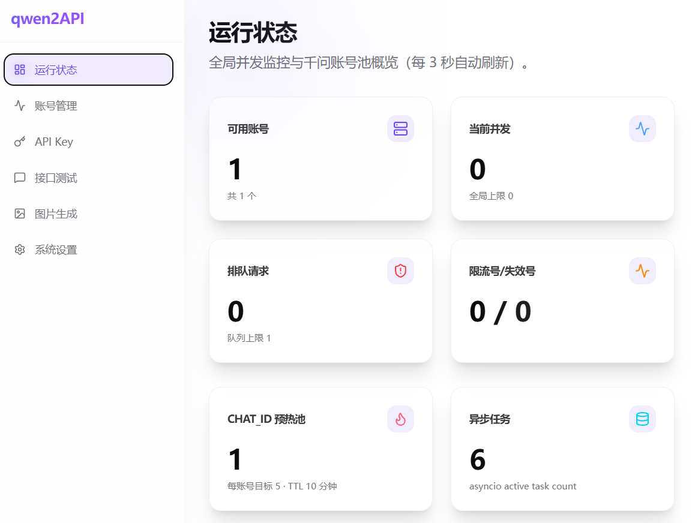

---
项目地址：https://github.com/YuJunZhiXue/qwen2API
---

## 目录

- [服务器推荐](#服务器推荐)
- [Docker 部署教程](#docker-部署教程)
  - [1. 安装 Docker](#1-安装-dockerubuntu24)
  - [2. 准备目录](#2-准备目录)
  - [3. 创建 docker-compose.yml](#3-创建-docker-composeyml)
  - [4. 创建 .env 配置](#4-创建-env-配置)
  - [5. 启动服务](#5-启动服务)
- [使用说明](#使用说明)
  - [登录管理台](#登录管理台)
  - [添加千问账号](#添加千问账号)
  - [调用 API](#调用-api)

---

## 服务器推荐

推荐海外服务器部署，避免国内地区限制，实现 24 小时自由调用，还可共享给朋友和同事。

**腾讯云轻量应用服务器**（首尔地区推荐）：

| 配置 | 规格 |
|------|------|
| CPU | 2 核 |
| 内存 | 4 GB |
| 带宽 | 30 Mbps |
| 系统盘 | 60 GB SSD |
| 月流量 | 1.5 TB |
| 价格 | **199 元/年**（可同价续费） |

> 建议系统选 Ubuntu24。

购买地址：https://curl.qcloud.com/oyWDLkRJ

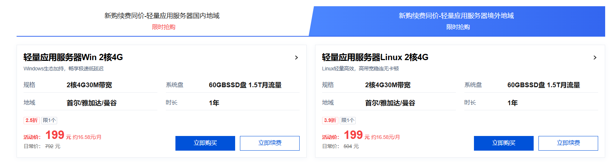

---

## Docker 部署教程

### 1. 安装 Docker（Ubuntu24）

```bash
sudo apt update
sudo apt install -y ca-certificates curl gnupg
sudo install -m 0755 -d /etc/apt/keyrings
curl -fsSL https://download.docker.com/linux/ubuntu/gpg | sudo gpg --dearmor -o /etc/apt/keyrings/docker.gpg
sudo chmod a+r /etc/apt/keyrings/docker.gpg
echo \
  "deb [arch=$(dpkg --print-architecture) signed-by=/etc/apt/keyrings/docker.gpg] https://download.docker.com/linux/ubuntu \
  $(. /etc/os-release && echo "$VERSION_CODENAME") stable" | \
  sudo tee /etc/apt/sources.list.d/docker.list > /dev/null
sudo apt update
sudo apt install -y docker-ce docker-ce-cli containerd.io docker-buildx-plugin docker-compose-plugin
sudo docker run hello-world
```

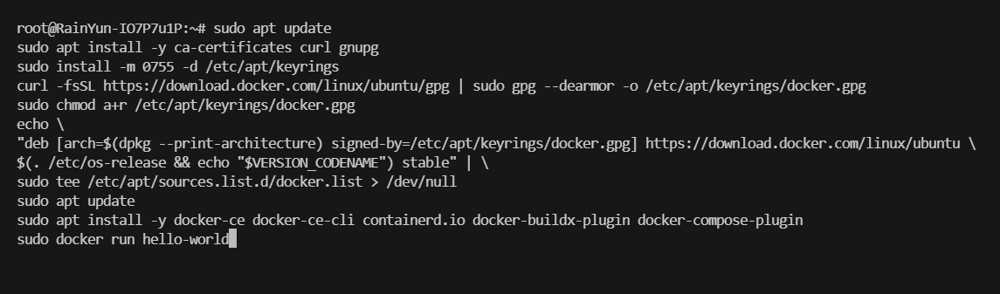

### 2. 准备目录

```bash
mkdir qwen2api && cd qwen2api
mkdir -p data logs
```

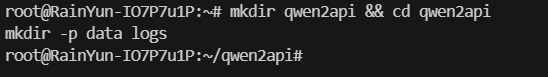

### 3. 创建 docker-compose.yml

```bash
sudo nano docker-compose.yml
```

填入以下内容：

```yaml
services:
  qwen2api:
    image: yujunzhixue/qwen2api:latest
    container_name: qwen2api
    restart: unless-stopped
    env_file:
      - path: .env
        required: false
    ports:
      - "7860:7860"
    volumes:
      - ./data:/workspace/data
      - ./logs:/workspace/logs
    shm_size: '256m'
    environment:
      PYTHONIOENCODING: utf-8
      PORT: "7860"
      ENGINE_MODE: "hybrid"
    healthcheck:
      test: ["CMD", "curl", "-f", "http://localhost:7860/healthz"]
      interval: 30s
      timeout: 10s
      start_period: 120s
      retries: 3
```

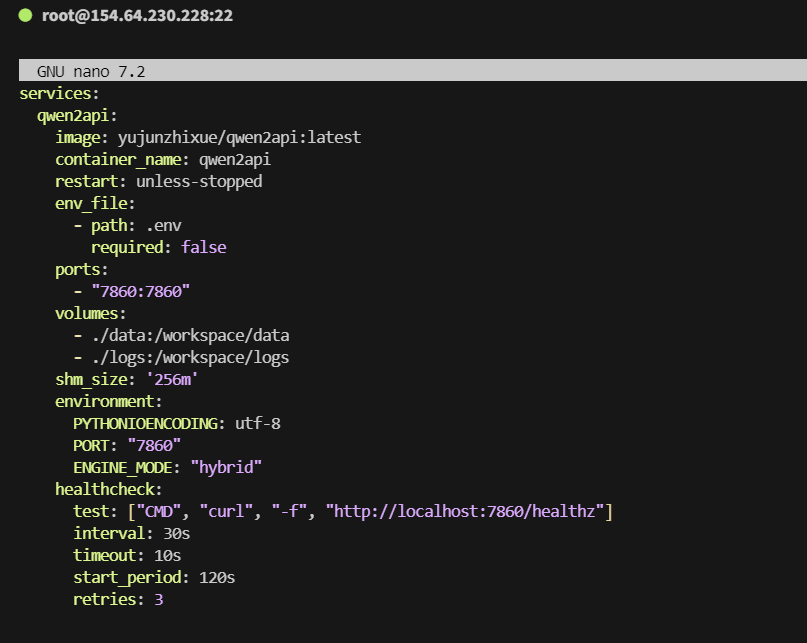

### 4. 创建 .env 配置

```bash
sudo nano .env
```

填入以下内容（**登录密钥必须修改为强密码**）：

```env
# ========== 必须修改 ==========
ADMIN_KEY=change-me-now              # 管理台登录密钥，必须修改为强密码！

# ========== 基础配置 ==========
PORT=7860                            # 服务监听端口
WORKERS=1                            # Uvicorn worker 数量，必须保持 1（多 worker 会导致 JSON 文件冲突）
LOG_LEVEL=INFO                       # 日志级别：DEBUG/INFO/WARNING/ERROR

# ========== 并发控制 ==========
MAX_INFLIGHT=1                       # 每账号最大并发请求数（账号多时可改为 2）
MAX_RETRIES=3                        # 请求失败最大重试次数（网络不稳定时增加到 5）

# ========== 限流冷却 ==========
ACCOUNT_MIN_INTERVAL_MS=1200         # 同账号两次请求最小间隔（毫秒），被限流时启用
REQUEST_JITTER_MIN_MS=120            # 请求前随机抖动最小值（毫秒）
REQUEST_JITTER_MAX_MS=360            # 请求前随机抖动最大值（毫秒）
RATE_LIMIT_BASE_COOLDOWN=600         # 限流基础冷却时间（秒），频繁限流时增加到 1200
RATE_LIMIT_MAX_COOLDOWN=3600         # 限流最大冷却时间（秒）

# ========== 数据文件路径（Docker 部署通常不需要改）==========
ACCOUNTS_FILE=/workspace/data/accounts.json
USERS_FILE=/workspace/data/users.json
CONTEXT_CACHE_FILE=/workspace/data/context_cache.json
UPLOADED_FILES_FILE=/workspace/data/uploaded_files.json
```

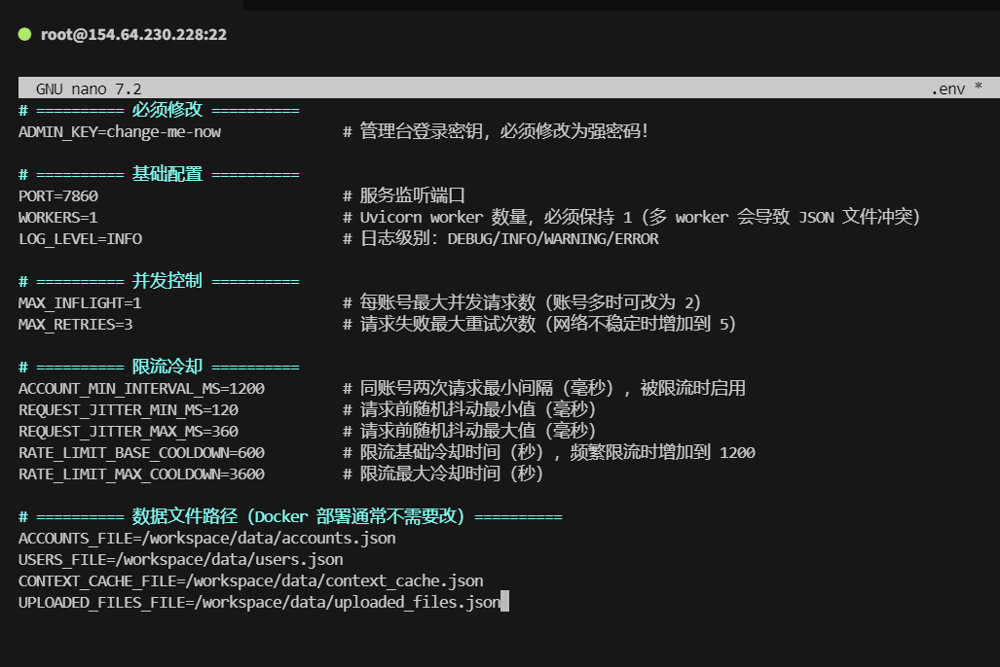

### 5. 启动服务

```bash
sudo docker compose up -d
```

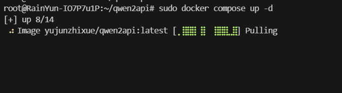

---

## 使用说明

### 登录管理台

浏览器访问：

```
http://你的服务器IP:7860
```

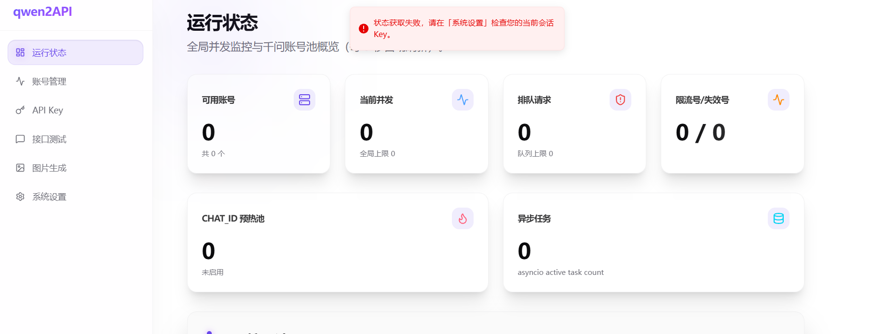

在系统设置中输入 `.env` 中配置的登录密钥：

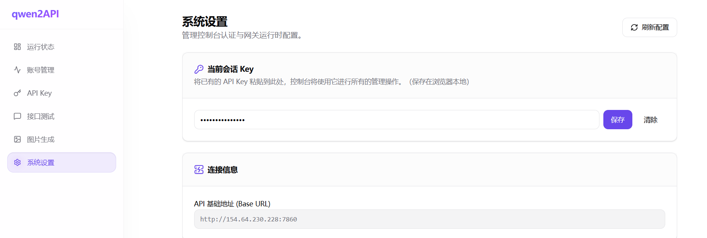

### 添加千问账号

1. 访问 [https://chat.qwen.ai/](https://chat.qwen.ai/) 获取 Token

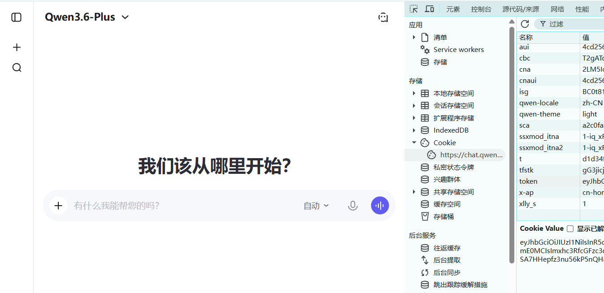

2. 将 Token 填入管理台，账号添加成功

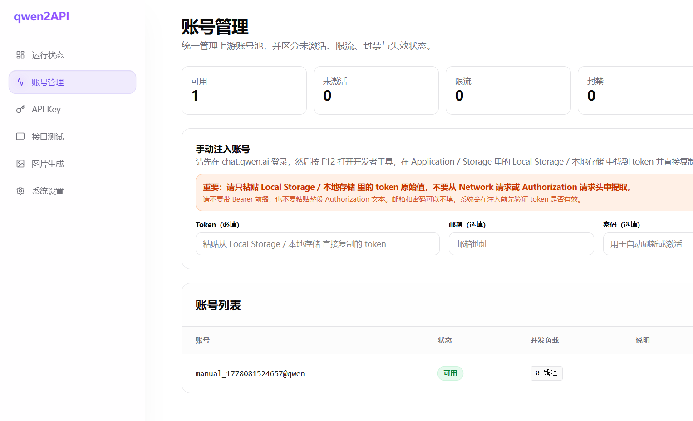

### 调用 API

| 参数 | 值 |
|------|-----|
| 接口地址 | `http://127.0.0.1:7860/v1/chat/completions` |
| 密钥 | 在管理台新建一个 API Key |
| 模型 | `qwen3.6-plus` |

测试成功示意：

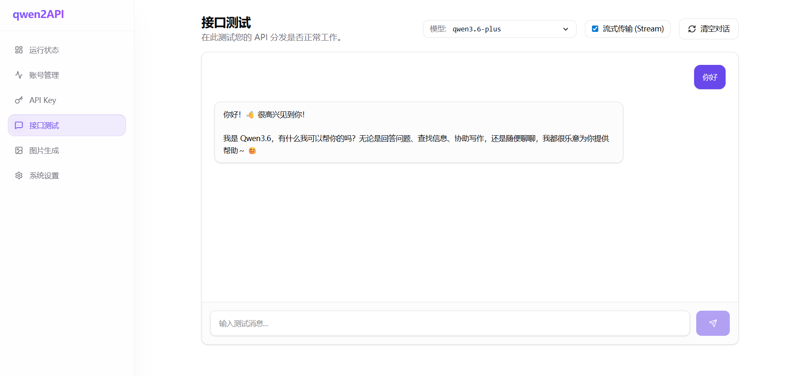
